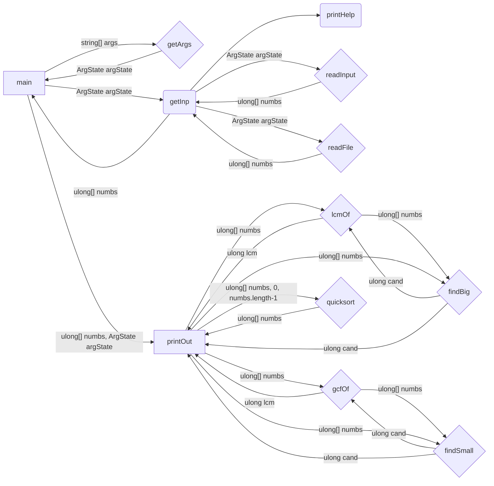

```
main
 |
 +-getArgs-+
 |         |
 +---------+
 |
 +-getInp-+-printHelp
 |        |
 |        +-readInput-+
 |        |           |
 |        +-----------+
 |        |
 |        +-readFile-+
 |        |          |
 |        +----------+
 |        |
 +--------+
 |
 +-printOut-+-lcmOf-+-findBig-+
 |          |       |         |
 |          |       +---------+
 |          |       |
 |          +-------+
 |          |
 |          +-gcfOf-+-findSmall-+
 |          |       |           |
 |          |       +-----------+
 |          |       |
 |          +-------+
 |          |
 |          +-findBig-+
 |          |         |
 |          +---------+
 |          |
 |          +-findSmall-+
 |          |           |
 |          +-----------+
 |
 +```
